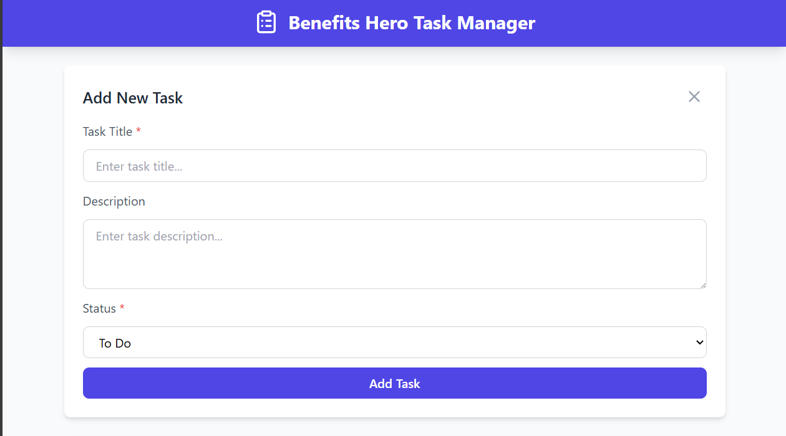

# Task Management App

A simple task management web app built with **Vue2.js** (frontend) and **Laravel** (backend).  
Users can create, update, delete, filter, and reorder tasks with a clean UI.

---

## 🚀 Features

- Add, edit, and delete tasks
- Mark tasks as **To Do**, **In Progress**, or **Done**
- Drag & drop reordering
- Filter tasks by status
- Toast notifications for actions (success/error)
- Loading spinner while fetching data

---

## 🛠️ Technologies Used

### Frontend

- [Vue.js 2 / Composition API](https://vuejs.org/)
- [Vuex](https://vuex.vuejs.org/) – state management
- [Axios](https://axios-http.com/) – API requests
- [Tailwind CSS](https://tailwindcss.com/) – styling
- [Lucide Vue](https://lucide.dev/) – icons
- [Vue Toast](https://github.com/MeForma/vue-toaster) – notifications

### Backend

- [Laravel](https://laravel.com/) – REST API
- [SqlLite](https://www.mysql.com/) – database

---

## 📦 Project Setup

### 1. Clone the repository

```bash
git clone https://github.com/your-username/task-app.git
cd task-app
```

### 2. Backend (Laravel API)

Go into the backend folder:

```bash
cd Backend
```

install Dependencies:

```bash
composer install
```

Create .env file:

```bash
cp .env.example .env
```

Generate app key:

```bash
php artisan key:generate
```

Setup database in .env, then run migrations:

```bash
php artisan migrate
```

Run backend Server:

```bash
Run backend server:
```

Backend will run on: [http://127.0.0.1:8000](http://localhost:8000)

### 3. Frontend (Vue.js)

Go into the frontend folder:

```bash
cd Frontend
```

Install dependencies:

```bash
npm install
```

Start dev server:

```bash
npm run dev
```

Frontend will run on: [http://localhost:3000](http://localhost:3000)

### API Routes

| Method | Endpoint          | Description         |
| ------ | ----------------- | ------------------- |
| GET    | `/api/tasks`      | Get all tasks       |
| POST   | `/api/tasks`      | Create a new task   |
| PUT    | `/api/tasks/{id}` | Update a task by ID |
| DELETE | `/api/tasks/{id}` | Delete a task by ID |

### ScreenShots





